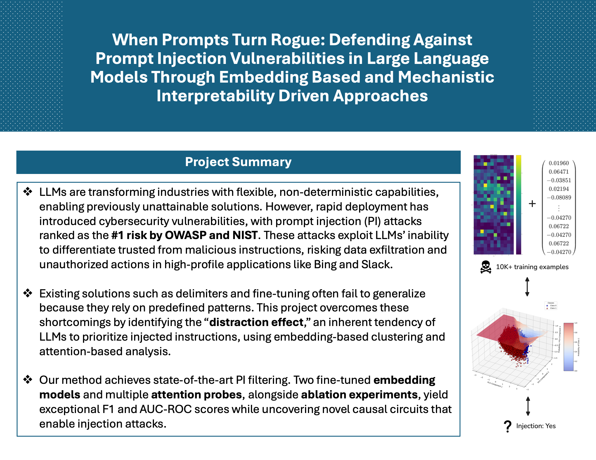
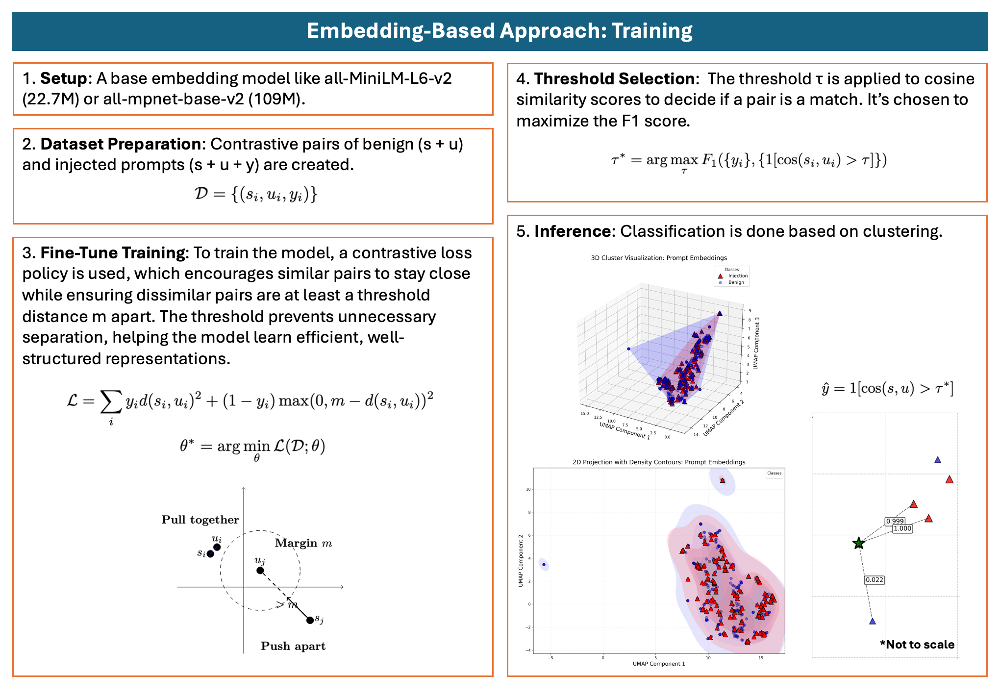
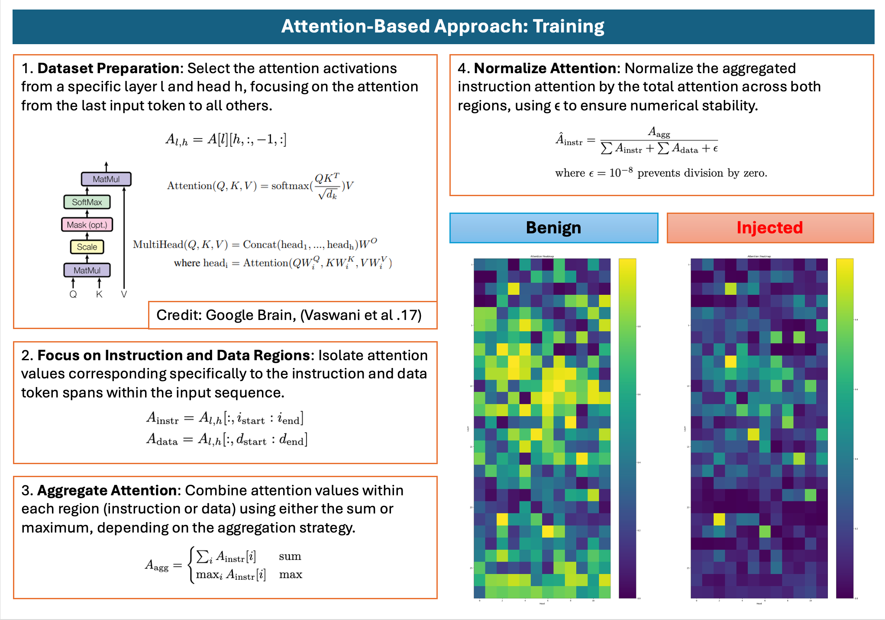
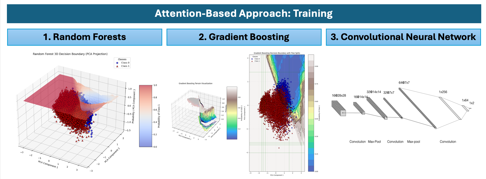

# 🪖 Prompt Helmet

> SOTA anomaly-detection algorithm to defend against prompt injection attacks.

## References

- What is prompt injection? [Watch Computerphile](https://www.youtube.com/watch?v=rAEqP9VEhe8) to learn why NIST calls it Gen AI's greatest flaw.

- Where are example datasets? [Checkout SPML](https://arxiv.org/abs/2402.11755), which includes thousands of prompt injection examples with real world system prompts.

## Abstract

LLMs are transforming industries with flexible, non-deterministic capa-
bilities, enabling solutions previously unattainable. However, their rapid de-
ployment has introduced cybersecurity vulnerabilities, with prompt injection (PI) attacks ranked as the 1 risk by OWASP and NIST. PI attacks exploit the
inability of LLMs to distinguish between trusted and malicious instructions,
posing risks such as data exfiltration and unauthorized actions in high-profile
applications like Bing and Slack. Unfortunately, existing solutions, such as system prompt delimiters and supervised fine-tuning, fail to generalize be-
cause of their over-reliance on learning predefined patterns. This project sidesteps these shortcomings by identifying the “distraction effect,” an intrin-
sic tendency of LLMs to prioritize injected instructions over intended ones, through a combination of embedding-based clustering and attention mecha-
nism analysis. Our method achieves SOTA-level PI filtering with exceptional F1 and AUC-ROC scores. For the embedding approach, we fine-tuned two
differently sized base models with a contrastive loss policy trained on 16,012
examples: one with 22.7M parameters (F1=0.99840, AUC-ROC=0.99905)
and another with 109M parameters (F1=0.99759, AUC-ROC=0.99968). For the mechanistic interpretability approach, we trained three probes on at-
tention activation matrices to detect shifts from the system prompt to in-
jected instructions across 7,594 examples, using a convolutional neural net-
work (F1=0.9896, AUC-ROC=0.9976), gradient boosting (F1=0.9843, AUC-
ROC=0.9967), and random forests (F1=0.9843, AUC-ROC=0.9965). Addi-
tionally, we further discover, through attention ablation experiments, that specific important heads in early layers are primary enablers of injection
attacks, which we use to uncover a novel causal circuit that enables the
distraction effect. Combining these approaches before and after a prompt
passes through the transformer presents a novel, multi-pronged strategy to
safeguard production LLM applications.

## Progress Tracker

Embedding model:

- Try different base models:

  - [x] all-MiniLM-L6-v2 (22.7M)
  - [x] all-mpnet-base-v2 (109M)

- [x] Measure the time per inference (ms)

- [ ] Add a vector database for a self-hardening defense

Attention model:

- Try different classifier models:

  - [x] Gradient Boosting
  - [x] Random Forest
  - [x] CNN

- Try different base LLMs:

  - [x] Qwen (1.5B)
  - [ ] Gemma (2B)
  - [ ] Mistral (7B)
  - [ ] Llama (8B)

- [x] Measure the time per inference (ms)

- Try ablation experiments:

  - [x] Swap ablation
  - [ ] Mean ablation
  - [ ] Zero ablation

Embedding + Attention model:

- [ ] Choose the best embedding model and best attention model

- [ ] Measure the time per inference (ms)
